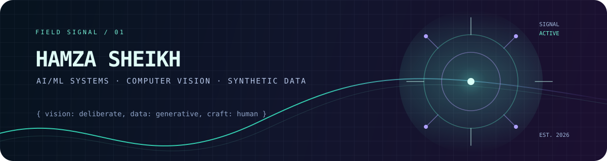

<p align="center">
  
</p>

<p align="center">
  <a href="#selected-systems">selected systems</a> · <a href="#field-notes">field notes</a> · <a href="https://github.com/hamza26051?tab=repositories">all repositories</a>
</p>

## I build AI systems that feel like products—not just demos.

I am Hamza Sheikh, an AI/ML developer working across computer vision, synthetic data, and applied machine-learning products. I like the hard middle: where an experiment becomes a usable workflow, where a model needs an interface, and where the honest caveat matters as much as the impressive result.

> **Current signal:** visual intelligence, generative data, and thoughtful tools for real people.

## Selected systems

<table>
  <tr>
    <td width="50%" valign="top">
      <h3>◌ <a href="https://github.com/hamza26051/LifeMirror">LifeMirror</a></h3>
      <p>An image-led reflection prototype that joins a mobile experience, a Flask service layer, and vision-language tooling without turning a photo into a verdict.</p>
      <p><code>React Native</code> <code>Flask</code> <code>MediaPipe</code> <code>YOLOv8</code></p>
    </td>
    <td width="50%" valign="top">
      <h3>✦ <a href="https://github.com/hamza26051/SynthData">SynthData</a></h3>
      <p>A synthetic-data workspace for GAN experiments, distribution checks, privacy exploration, bias-aware evaluation, and verifiable generation workflows.</p>
      <p><code>Python</code> <code>GANs</code> <code>Privacy</code> <code>Data quality</code></p>
    </td>
  </tr>
  <tr>
    <td width="50%" valign="top">
      <h3>⌁ <a href="https://github.com/hamza26051/cv-lab">Computer Vision Lab</a></h3>
      <p>A hands-on record of learning to make images computable: practical notebooks, image-processing exercises, and visual-model experiments.</p>
      <p><code>Python</code> <code>OpenCV</code> <code>Jupyter</code> <code>Deep learning</code></p>
    </td>
    <td width="50%" valign="top">
      <h3>↗ <a href="https://github.com/hamza26051/VeriDrive">VeriDrive</a></h3>
      <p>An MLOps-oriented prototype for analysing social-content signals, with testing, containerisation, drift monitoring, model promotion, and review paths.</p>
      <p><code>FastAPI</code> <code>Transformers</code> <code>Docker</code> <code>CI/CD</code></p>
    </td>
  </tr>
</table>

## Field notes

<details>
<summary><b>Open the build philosophy</b></summary>

<br>

- Start with the user journey, then choose the model—not the other way around.
- Treat evaluation, provenance, privacy, bias, and failure modes as part of the product.
- Prefer a clear limitation to an inflated claim. The best technical work is credible enough to inspect.
- Keep the presentation as intentional as the pipeline: a project should be understandable before its code is read.
</details>

<details>
<summary><b>Open the working map</b></summary>

<br>

```text
INPUT → MODEL / PIPELINE → EVALUATION → HUMAN-READABLE EXPERIENCE
  images       vision + ML       quality + limits      product surface
  datasets     generation        privacy + bias        useful context
```
</details>

## The toolkit I reach for

`Python` · `PyTorch` · `TensorFlow` · `scikit-learn` · `OpenCV` · `React Native` · `Flask` · `FastAPI` · `Docker` · `Firebase` · `GitHub Actions`

---

<p align="center"><sub>Built with curiosity, strong opinions about clarity, and room for better questions.</sub></p>
